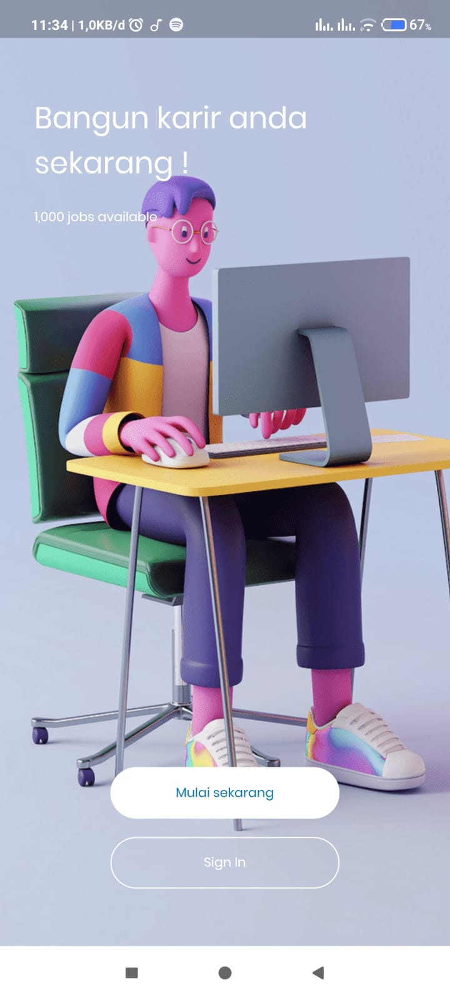
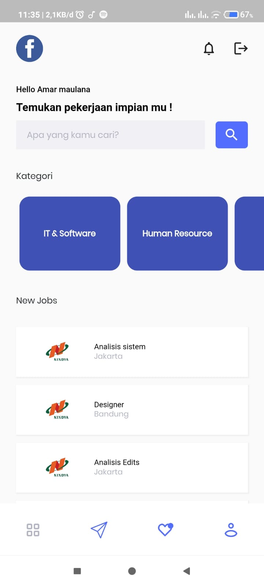
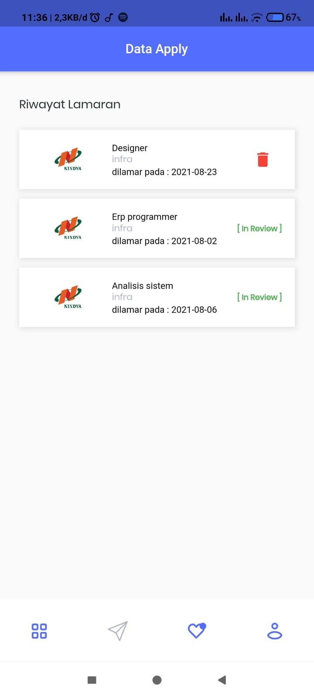

# Mobile apps:  Jobmarket .

## Develop
- Use Flutter and Provider state management.

## Preview

 
 

<!-- ## Getting Started
- Fork or Clone the Repository
- Give a star if this repository useful
 -->
